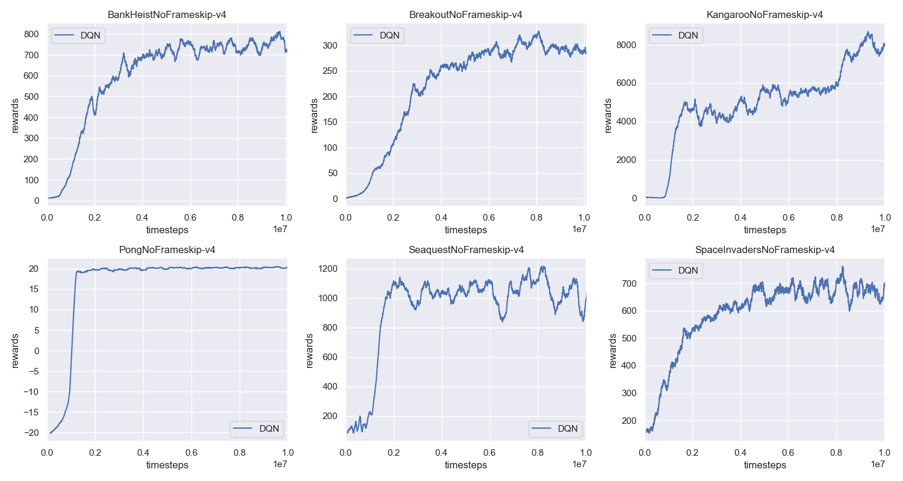
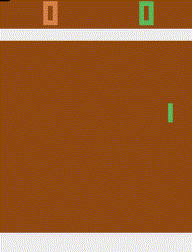

# Deep Q-Learning Network (DQN)
This is a pytorch implementation of ["Human-level control through deep reinforcement learning"](https://storage.googleapis.com/deepmind-media/dqn/DQNNaturePaper.pdf). In this latest version, I use the Atari games. But in the future, I will bring the Flappy Bird back!

## Requirements
- python-3.5.2
- openai-gym
- pytorch-0.4.0
- opencv-python
## Installation
Install OpenAI Baselines (**the openai-baselines update so quickly, please use the older version as blow, will solve in the future.**)
```bash
# clone the openai baselines
git clone https://github.com/openai/baselines.git
cd baselines
git checkout 366f486
pip install -e .

```
## Instruction to run the code
### Train the Network:
```bash
python train_network.py --cuda (if you have a GPU, you can use this flag)

```

### Test the Network:
```bash
python demo.py

```
### Download the Pre-trained Model
Please download them from the [Google Driver](https://drive.google.com/open?id=1ZXqRKwGI7purOm0CJtIVFXOZnmxqvA0p), then put the `saved_models` under the current folder.

## Results
### Training Performance

### Demo: PongNoFrameskip-v4



