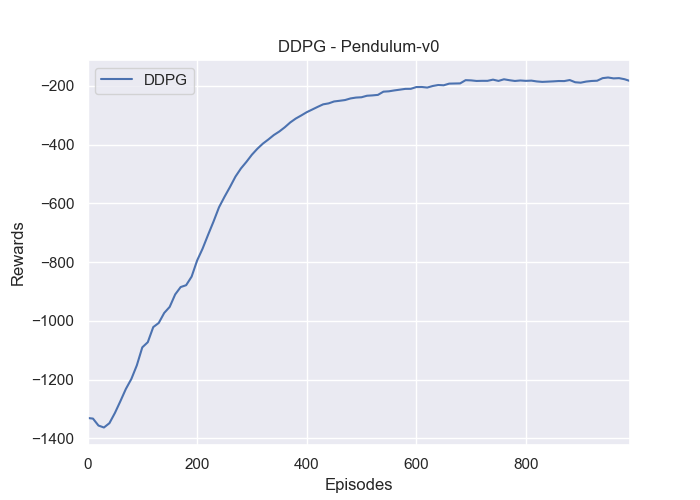

# Deep Deterministic Policy Gradient (DDPG)
This is the pytorch version of the DDPG. The paper could be found [Here](https://arxiv.org/abs/1509.02971).
## Requirements
- python-3.5.2
- openai-gym
- pytorch-0.4.0
## Instruction to run the code
### Train the Network:
```bash
python train_network.py --cuda (if you have a GPU, you can use this flag)

```
### Test the Network:
```bash
python demo.py

```
### Download the Pre-trained Model
Please download them from the [Google Driver](https://drive.google.com/open?id=1ZXqRKwGI7purOm0CJtIVFXOZnmxqvA0p), then put the `saved_models` under the current folder.

## Results
### Training Performance

### Demo: Pendulum-v0


