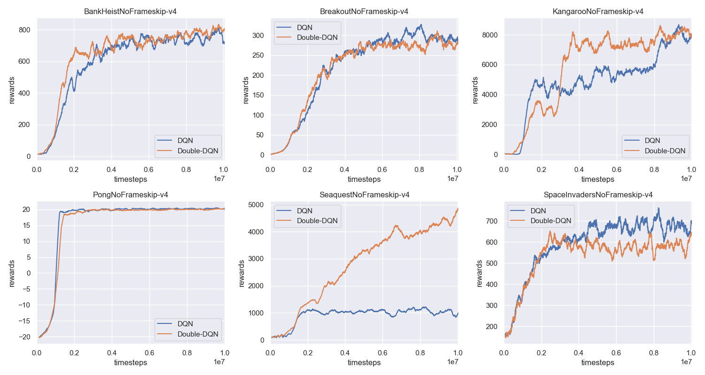
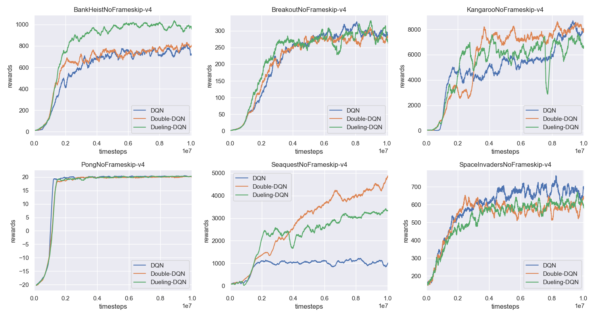
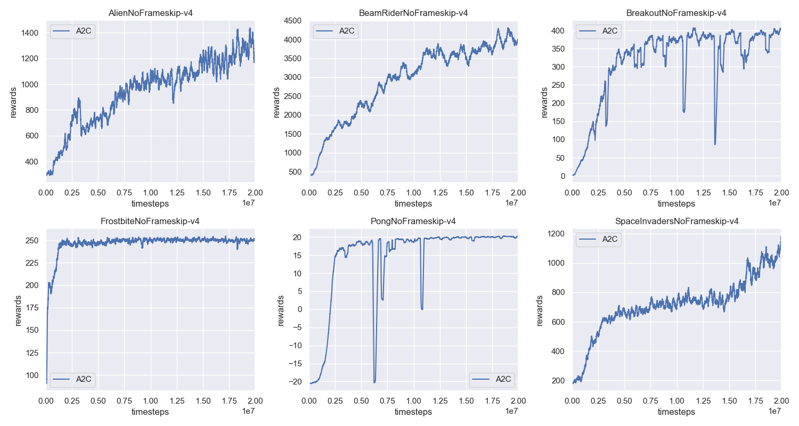
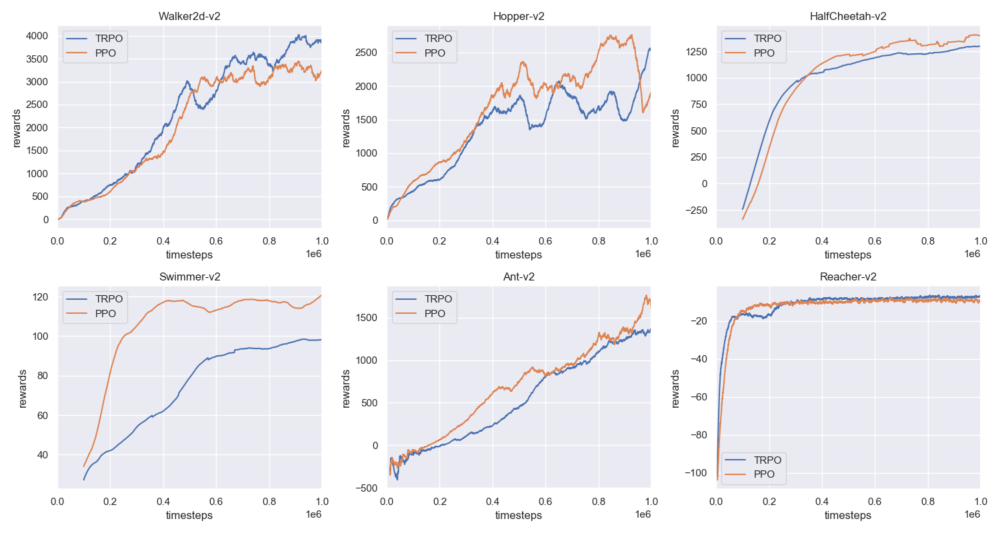
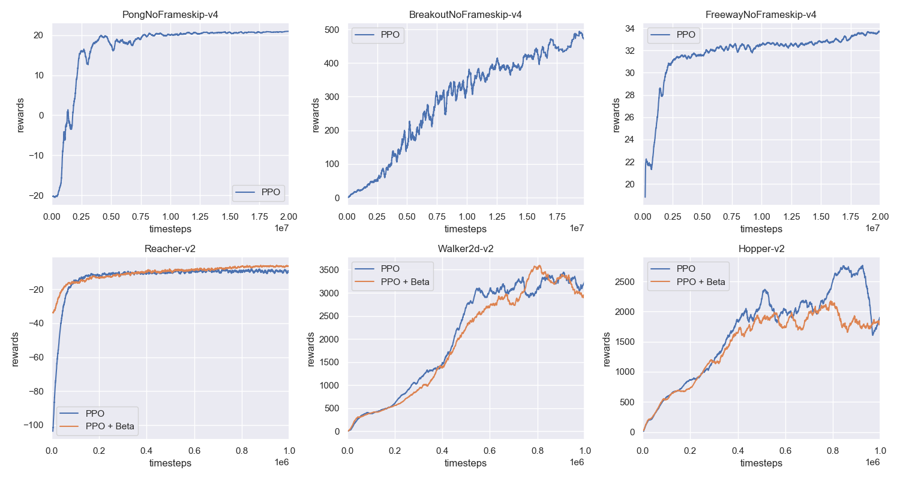

# Deep Reinforcement Learning Alogrithms
    
   
This repository will implement the classic deep reinforcement learning algorithms. The aim of this repository is to provide clear code for people to learn the deep reinforcement learning algorithm. In the future, more algorithms will be added and the existing codes will also be maintained. 
- [x] [Deep Q-Learning Network(DQN)](01-deep-q-network/)
- [x] [Double DQN(DDQN)](02-double-dqn/)
- [x] [Dueling Network Architecture(Dueling DQN)](03-dueling-network/)
- [x] [Deep Deterministic Policy Gradient(DDPG)](04-deep-deterministic-policy-gradient/)
- [x] [Advantage Actor-Critic(A2C)](05-advantage-actor-critic/)
- [x] [Trust Region Policy Optimization(TRPO)](06-trust-region-policy-optimization/)
- [x] [Proximal Policy Optimization(PPO)](07-proximal-policy-optimization/)
- [ ] Actor Critic using Kronecker-Factored Trust Region(ACKTR)
## Update Information
**2018-10-17** - In this update, most of algorithms have been imporved and **add more experiments with plots** (except for DPPG). The **PPO** now supports **atari-games** and **mujoco-env**. The **TRPO** is much stable and can have better results!
## TODO List
- [ ] add prioritized experience replay.
- [ ] in the future, we will not use openai baseline's pre-processing functions.
- [ ] improve the **DDPG**.
## Requirements
- python-3.5.2
- openai-gym
- mujoco-py-1.50.1.56
- pytorch-0.4.0
- [openai-baselines](https://github.com/openai/baselines)
## Installation
1. install the pytorch
```bash
plase go to official webisite to install it: https://pytorch.org/

Recommend use Anaconda Virtual Environment to manage your packages

```
2. install openai-baselines (**the openai-baselines update so quickly, please use the older version as blow, will solve in the future.**)
```bash
# clone the openai baselines
git clone https://github.com/openai/baselines.git
cd baselines
git checkout 366f486
pip install -e .

```
## Instructions
1. select the suitable algorithms
```bash
cd <the-rl-algorithm>
```
2. all of the parameters are defined in the `arguments.py`, you can train your model with suitable hyper-parameters.
3. train the networks
```bash
python train_network.py --env-name=<env-name> --cuda (only TRPO not support GPU) --<other-flags>

```
4. test the networks
```bash
python demo.py --env-name=<env-name>

```
5. download the **pre-trained** models  
Please download them from the [Google Driver](https://drive.google.com/open?id=1ZXqRKwGI7purOm0CJtIVFXOZnmxqvA0p), then put the `saved_models` under the corresponding algorithm's folder.

## Performance of the algorithms
### Deep Q Network (DQN)

### Double DQN

### Dueling Network

### Advantage Actor Critic (A2C)

### Trust Region Policy Optimization (TRPO)

### Proximal Policy Optimization (PPO)


## Acknowledgement:
- [Ilya Kostrikov's GitHub](https://github.com/ikostrikov)
- [Openai Baselines](https://github.com/openai/baselines)

## Papers Related to the Deep Reinforcement Learning
[1] [A Brief Survey of Deep Reinforcement Learning](https://arxiv.org/abs/1708.05866)  
[2] [The Beta Policy for Continuous Control Reinforcement Learning](https://www.ri.cmu.edu/wp-content/uploads/2017/06/thesis-Chou.pdf)  
[3] [Playing Atari with Deep Reinforcement Learning](https://www.cs.toronto.edu/~vmnih/docs/dqn.pdf)  
[4] [Deep Reinforcement Learning with Double Q-learning](https://arxiv.org/abs/1509.06461)  
[5] [Dueling Network Architectures for Deep Reinforcement Learning](https://arxiv.org/abs/1511.06581)  
[6] [Continuous control with deep reinforcement learning](https://arxiv.org/abs/1509.02971)  
[7] [Continuous Deep Q-Learning with Model-based Acceleration](https://arxiv.org/abs/1603.00748)  
[8] [Asynchronous Methods for Deep Reinforcement Learning](https://arxiv.org/abs/1602.01783)  
[9] [Trust Region Policy Optimization](https://arxiv.org/abs/1502.05477)  
[10] [Proximal Policy Optimization Algorithms](https://arxiv.org/abs/1707.06347)  
[11] [Scalable trust-region method for deep reinforcement learning using Kronecker-factored approximation](https://arxiv.org/abs/1708.05144)  

